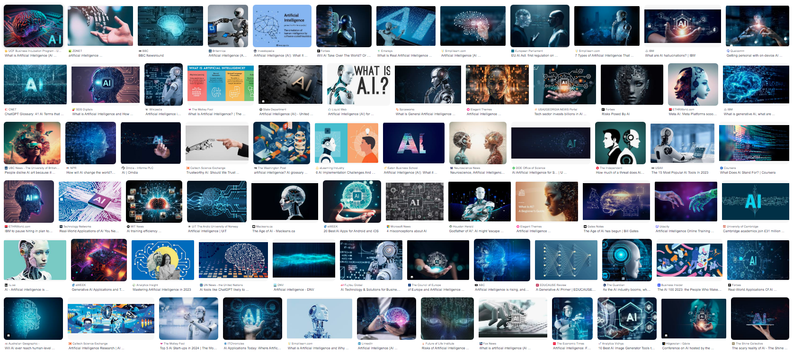
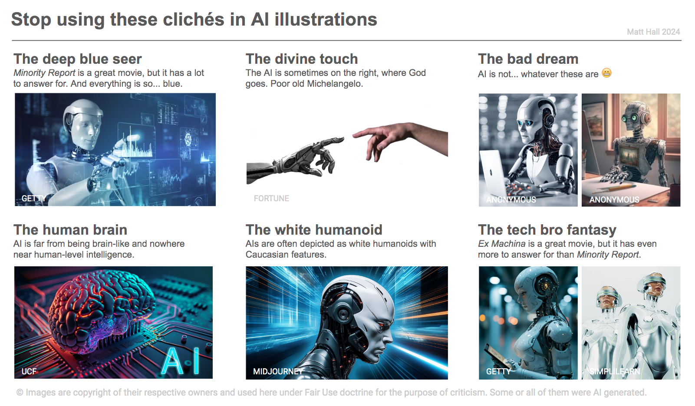
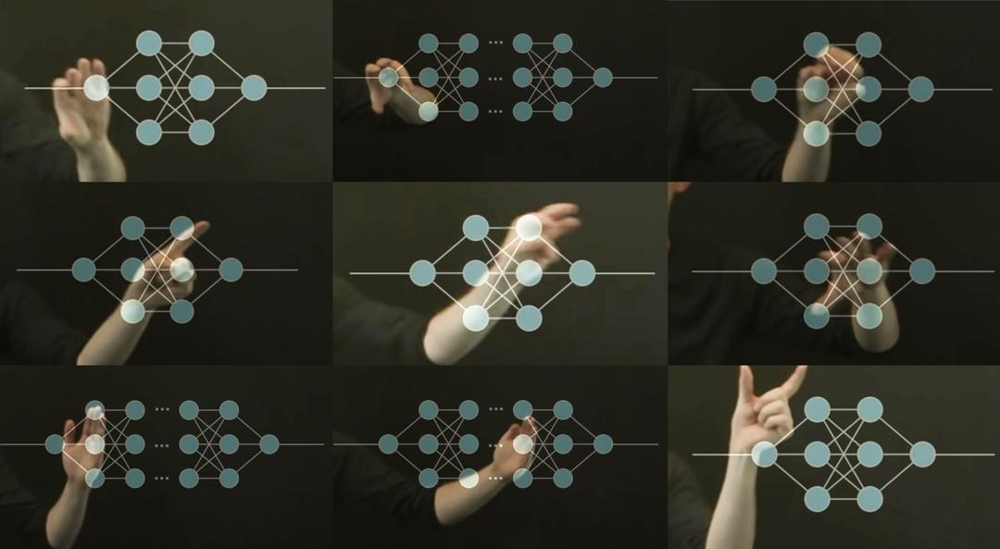

The recent resurgence of the word 'AI' (it seems like more than a mere abbreviation) brings new communication challenges. The term is so overloaded with so many conflicting meanings as to be useless on its own, without careful delineation. But even a blunt instrument can be useful &mdash; and sometimes an advantage. Just remember to sharpen it when you need to.

The communication challenges are made worse &mdash; much, much worse &mdash; by the ham-fisted, unimaginative, and sometimes downright unethical choice of accompanying images. Images which are often generated by AI, cuz we so clever. The generative model was trained on... well, we really have no idea so let's just say it was effectively trained on everything, ever. Including all previous attempts to illustrate the concept of AI, most of which were probably found in stock (i.e. lame and/or nonsense) images or corporate (also lame) marketing material (lies). Cool.

So let's see what we made. Google Image Search on "AI", behold:

## What does AI look like? 

- Blueness (40 out of 72 images, 56%), did IBM start this?
- Brains (14/72, 19%), often split or somehow computerized.
- Humanoids (30/72, 42%), of a very particular type (see below).
- Riffs on _The Creation of Adam_ by Michelangelo (4/72, 5.6%), one of them with the human on the left
- A lot of whatever that holographic display Tom Cruise had in _Minority Report_

To be fair, one of the images has some information on it. And some contain actual things that are genuinely relevant, probably by accident:

- Humans (14/72, 19%), imagine!
- Circuit boards (8/72, 11%)
- Code (2/72, 2.6%)
- A neural network (1/72, 1.3%)
- Computers (1/72, 1.3%)

It looks pretty bad from afar &mdash; look closer, and it gets worse. The creepy robots are nearly always white, with Western European features and completely devoid of personality or facial expressions. Not only do they appear to have genders, but they are overtly sexualized: the "men" are muscular with chiseled jaws, and the women are conventionally beautiful, often with a human face. And I haven't counted but I'm willing to bet that most of those in assistant roles are "female". 

None of the images contains:

- People being educated, or showing concern, about AI
- A wind farm or solar array being designed with AI
- A doctor or farmer being assisted by AI
- People designing, making or testing AI systems
- People regulating or preventing the use of AI
- Photons with wavelengths longer than 500 nm

## It's not just me

Things have been written about this. [AI Myths](https://www.aimyths.org/ai-equals-shiny-humanoid-robots) has a wonderful article about shiny humanoid robots. A report from boffins at the Royal Society, _Portrayals & Perceptions of AI and Why They Matter_ (2017) is predictably erudite, but predates the current hype cycle. Philipp Schmitt (2021) writes beautifully about the subject. He says,

> [These images] are harmful to the public imagination, because metaphors matter. They influence how we develop, think of and design policy for emerging technologies, just as they have for nuclear power or stem cell research in the past.

Romele (2022) goes further, albeit in rather technical language, explicitly condemning several of these tropes as unethical:

> While the ethics of science communication generally promotes the practice of virtues like modesty, humility, sincerity, transparency, openness, honesty, and generosity, stock images and other popular visual representations of AI are arrogant, pompous, and overconfident. [...] The problem with these images is not their lack of reference. Rather, it lies in the way they anesthetize any debate and disagreement about AI.

**I agree completely. These images are arrogant. They are becoming part of the popular understanding of AI. They mostly remove actual humans doing actual things with actual AI, and in doing so they collectively tell a huge fib about what AI is, who it is for, and what the issues around it are.**

## What to do about it

I think we need to stop using these sorts of images immediately. I know they seem 'right' &mdash; ubiquity is intoxicating. Here, I made you a list of things to look out for, I hope it's useful:

The good news is, help it at hand! In researching this post, I came across [betterimagesofai.org](https://betterimagesofai.org/) and it's the best thing ever. Instead of just whining about it like _some people_, they are "researching, creating, curating and providing Better Images of AI", and sharing them with the world under open licenses. I love it. And there are some great images in their collection, so check them out.

Alexa Steinbrück / Better Images of AI / Explainable AI / CC-BY 4.0

### References

- The Royal Society (2017). _Portrayals & Perceptions of AI and Why They Matter_, white paper, [available online](https://royalsociety.org/-/media/policy/projects/ai-narratives/AI-narratives-workshop-findings.pdf).
- Schmitt, P (2021). Blueprints of Intelligence. _Noema Magazine_ (Berggruen), [available online](https://www.noemamag.com/blueprints-of-intelligence/)
- Romele, A (2022). Images of Artificial Intelligence: a Blind Spot in AI Ethics. _Philosophy & Technology_ **35** (4). [DOI: https://doi.org/10.1007/s13347-022-00498-3](https://doi.org/10.1007/s13347-022-00498-3)
