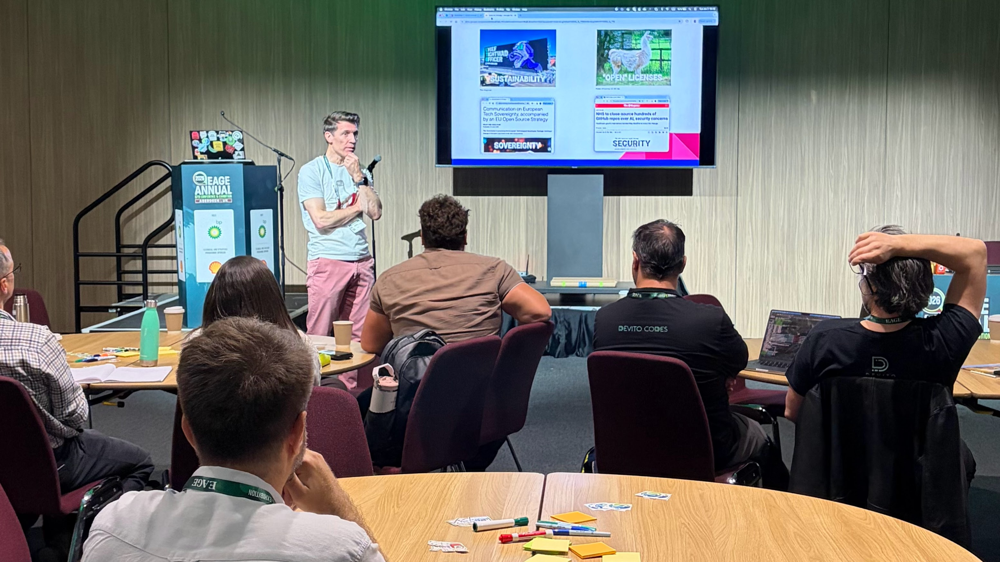

On Sunday [Guillermo Vargas](https://www.linkedin.com/in/gavargas/) (Shell) and I hosted the 4th EAGE open source workshop, _Open for Energy_. The first of these sessions was hosted by Joe Dellinger (BP) in Vienna in 2006; dGB had only recently released OpendTect, Chuck Mosher's JavaSeis was brand new, and Sergey Fomel's Madagascar was launched at that workshop. I was not there, I can only imagine that the session was full of hope and expectation.

Hope and expectation still prevail, but there is a good dollop of uncertainty, maybe even a little fear — but also plenty of new questions and more than enough curiosity and creativity to start answering them.

Here's what we heard:

## Matteo Ravasi, Shearwater: from pet project to fiscally supported workhorse

[PyLOps](https://pylops.readthedocs.io/en/stable/) — Python linear operators — started at Statoil when Matteo worked there. At the time, there was a conscious effort by the company to publish more open-source, and proper documentation, testing, and a trustworthy architecture were hard requirements. Matteo directly pointed to this foundation as a success factor for the project. After leaving Equinor, Matteo guided the project into the [NumFOCUS](https://numfocus.org/) portfolio, and this provided access to [Google's Summer of Code](https://summerofcode.withgoogle.com/)allowing for someone to be paid to accomplish very high impact but difficult to achieve features. Today, PyLOps is used daily for serious work so if you haven't seen it yet — [check out the repo](https://github.com/PyLops/pylops).

## Julien Moreau, The NW Edge: open hardware for hydrogen detection

Open hardware does not often attract much attention, certainly not in earth science, but [Julien (GitHub)](https://github.com/boorhin) wants to change that. He showed some "data" from a commercial H2 sensor that must have had a signal:noise ratio close to zero. So, using off-the-shelf components and well-honed hacking skills, he built a water-cooled device that he has deployed in both rural France and in volcanic fumaroles in Djibouti. And the data is beautiful! His lesson for everyone: complexity only adds cost, reduces maintainability, and ultimately excludes ordinary users. The only problem he has now is: how do you actually share a hydrogen detector? 🤔

## Collin Cronkite-Ratcliff, USGS: modern public domain software

The USGS was founded in 1879, so maybe it's natural that some legacy projects only exist as punch cards for Fortran. For example, the [gravmagsubs](https://code.usgs.gov/gmegsc/gravmagsubs) project is partly based on [Plouff 1977](https://pubs.usgs.gov/of/1977/0535/report.pdf) (check out the original code listing in the link!). Like the rest of the US federal government, USGS products are mostly public domain — so there's a strong "open by default" policy and, accordingly, the USGS maintains nearly 1000 public domain software (e.g. under [CC-0 licenses](https://creativecommons.org/publicdomain/zero/1.0/)), mostly [on GitLab](https://code.usgs.gov/usgs). There are packages in hydrology (e.g. MODFLOW) and geophysics, but minerals resources are the hottest current topic (e.g. [this R package](https://code.usgs.gov/g3sc/qmra_pooleddata)).

## Andrea Morales, GemPy: four pillars in the Temple of Zeus

Andrea is a researcher at RWTH and a contributor to both [GemPy](https://www.gempy.org/) and [PyGIMLi](https://github.com/gimli-org/pygimli). GemPy, open-sourced in 2015, is a tool for structural geological modeling under uncertainty, with PyGIMLi a way to connect geology to geophysics. Andrea focused on the challenges of maintaining open-source projects: GemPy is actively developed and it has a lot of  users, but they have found it difficult to construct the four pillars of support they need: [Terranigma](https://www.terranigma-solutions.com/) provides consulting and development services on the core tools, [RWTH](https://www.rwth-aachen.de/go/id/a/?lidx=1) provides research motivation, the _community_ provides ideas and contributions, while _funding_ provides sustainability. These last two are the big challenges — but Andrea is optimistic about the future. [GitHub repo.](https://github.com/gempy-project/gempy)

## Nanne Hemstra, dGB: proof that this all works!

dGB Earth Sciences [OpendTect](https://dgbes.com/software/opendtect/) is an ["open-core"](https://en.wikipedia.org/wiki/Open-core_model) integrated seismic interpretation platform, released as dTect in 2002 and open sourced in 2005. Later, in 2009, it adopted the GPL to help clarify the rights of users and of dGB. Today, it is arguably the most successful open-source project in subsurface, dGB been a persistent innovator in not only software and geoscience but also in business. Nanne highlighted the importance of software architecture and data structures used since the creation of the project, which continue to make it possible to quickly and cleanly add new features and capabilities to the product.
 
## Gerard Gorman, Imperial College London: a case-study of academic-first code

[The Devito project](https://github.com/devitocodes/devito) is one of the most coherent projects in the computational ggeophysics ecosystem, but it is a relative newcomer having open-sourced in 2016. Echoing Joe Dellinger's words quoted by me at the start, Gerard's conviction is that "open source accelerates innovation". The catch: "sustainability is structurally hard" — and is arguably the unsolved problem in open source. Reflecting on his experience running [Devito Codes Ltd](https://www.devitocodes.com/), Gerard enumerated some myths that, if unacknowledge, hurt sustainability: "open source is free", "if it's popular it must be sustainable", "we can always fork it", and "AI can replace maintainers". Sound familiar?

## Matt Hall, Equinor: inside a large open-source publisher

[Equinor's](https://www.equinor.com/en/) open source efforts, which have been underway since at least 2018, are very much alive. There are around original 500 open source projects on [the company's GitHub account today](https://github.com/equinor), covering a wide range of domains, from data assimilation to rock physics to robotics. Although this number of repos is a little anomalous in the world of energy, it's not unusual at all in the world of technology-centric companies. Most developers in Equinor are well aware that the company has an 'open first', and many want to participate in it. This strategy has pay-offs in terms of improved code quality and recruiting — but the main motivation is collaboration, for example with research institutes and business partners.

## Mark Roberts, TGS: a modern seismic data format

All geophysicists have opinions about SEG-Y, the venerable seismic exchange format — partly because it lacks a reference implementation, and partly because it was originally designed for tape storage, it has ended up being highly idiosyncratic and  poorly suited to modern geophysical computing. Leaning on established technologies, chiefly [Zarr](https://zarr.dev/) and [Xarray](https://xarray.dev/), Mark described [TGS's cloud-native storage project MDIO](https://www.tgs.com/technical-library/mdio-open-source-format-for-multidimensional-energ-data), which the company now uses exclusively. For example, all customer deliveries are produced & streamed from MDIO files, using customer entitlement polygons to apply licenses and policies when necessary. [GitHub repo.](https://github.com/TGSAI/mdio-python)

## Mathias Louboutin, Georgia Tech

Referencing David Donoho's influential 2024 [paper on frictionless reproducibility](https://hdsr.mitpress.mit.edu/pub/g9mau4m0/release/2), Mathias pointed out that computational geophysics, while doing well on open code, is perhaps lacking open data. The SLIM research team at Georgia Tech, under the direction of Felix Herrmann, is working on foundation models for seismic — a critical piece of the landscape for the sensible application of generative AI in subsurface. Mathias described a multiphysics model representing latent variables → porosity–permeability → CO2 → wavespeed → timelapse data where everyone one of those arrows is differentiable. A good way in to this world is probably to start with the [`InvertibleNetworks.jl`](https://github.com/slimgroup/InvertibleNetworks.jl) library.

## John Stevenson, BGS: a QGIS plugin for field geology

John is Research Software Engineering Lead at [the British Geological Survey](https://www.bgs.ac.uk/) in Edinburgh. (If you have not heard of it, reseach software engineering is the newly recognized role of properly supporting an organization's scientific and technical computing effort; check out [the Society of Research Software Engineering](https://society-rse.org/).) Thanks to John and others, the BGS is a big user of the icon open-source GIS [QGIS](https://qgis.org/), and John highlighted the usefulness of QGIS as a platform for software delivery with CRAG, for the Collection and Reporting of Associated Geodata. The plugin enables field geologists to connect field observations with photos and sketches to help create georefenced projects. They store everything using [the GeoPackage format](https://www.geopackage.org/) — more testimony to the superiority of modern open formats over legacy propietary ones. CRAG will be released soon on [the BGS GitHub](https://github.com/BritishGeologicalSurvey).

## Shaowen Wang, KAUST: waveform solutions for any occasion

Shaowen recently finished his PhD as part of the DeepWave consortium at KAUST, working on SWEEP. The marketing headline for SWEEP does sound very cool: "What if every seismic wave equation could live in one memory-efficient, multi-platform package?". The pipeline uses the Devito symbolic domain-specific language, [SeisFlows](https://github.com/adjtomo/seisflows), [the Deepwave toolbox](https://zenodo.org/records/8381177) and Shaowen's [own SWEEP tool](https://arxiv.org/abs/2604.14189), the 'seismic wave equation exploration platform'. The general idea is to support a wide range of use-cases with simple 'menus' of options: acoustic or elastic, Torch or Jax, 32-bit or 16, forward model or FWI – then to execute the plan. [GitHub repo.](https://github.com/DeepWave-KAUST/sweep)

## Bob Clapp, Google X: open models & synthetics

A legend of geophysical programming, Bob started off with the timeline of his involvement in SEPLib. I could have happily listed to a couple of hours of these stories, but he compressed 30 years of geophysical programming into about 2 minutes! The story included adventures with SEP model builder and CUDA, and segued into his current project: generating 10's to 100's of procedurally generated earth models with corresponding seismic volumes. A sort of "Marmousi generator" perhaps... except I didn't catch if the model emits a single pseudo-final-stack volume or is even capable of producing gathers. (If it doesn't today, I'm certain it will soon.) Bob's team is [presenting their work](https://icml.cc/virtual/2026/poster/61078) at ICML in Seoul, Korea, at the beginning of July; I expect we will see the first release of these models around that time.

## What is the state today?

After a full day of hearing these stories and animated discussion, I felt we had gathered some important data — and maybe anecdata – but not really been able to process much of it. No doubt each will have their own take on what insights these stories and data lead to. But I think a few themes emerged, as well as some ideas what the future might hold.

**I will try to summarize and look ahead in a future post. Soon!**

---

<small>For the record, the following open source superheroes came to the session: Matteo Ravasi (Shearwater), Julien Moreau (The NW-Edge), Collin Cronkite-Ratcliff (USGS), Andrea Balza Morales (RWTH Aachen), Nanne Hemstra (dGB), Gerard Gorman (Imperial College London), Mark Roberts (TGS), Mathias Louboutin (Georgia Tech), John Stevenson (BGS), Shaowen Wang (KAUST), Matt Hall (Equinor), Guillermo Vargas (Shell), Einar Landre (Equinor), Doug McClymont (Tullow), Tariq Alkhalifah (KAUST).</small>
