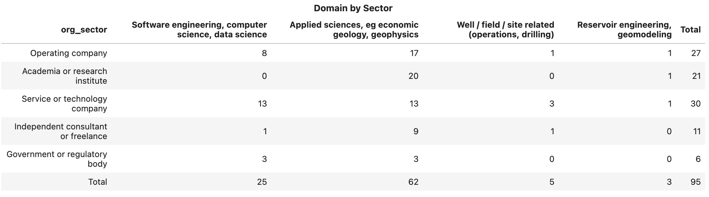
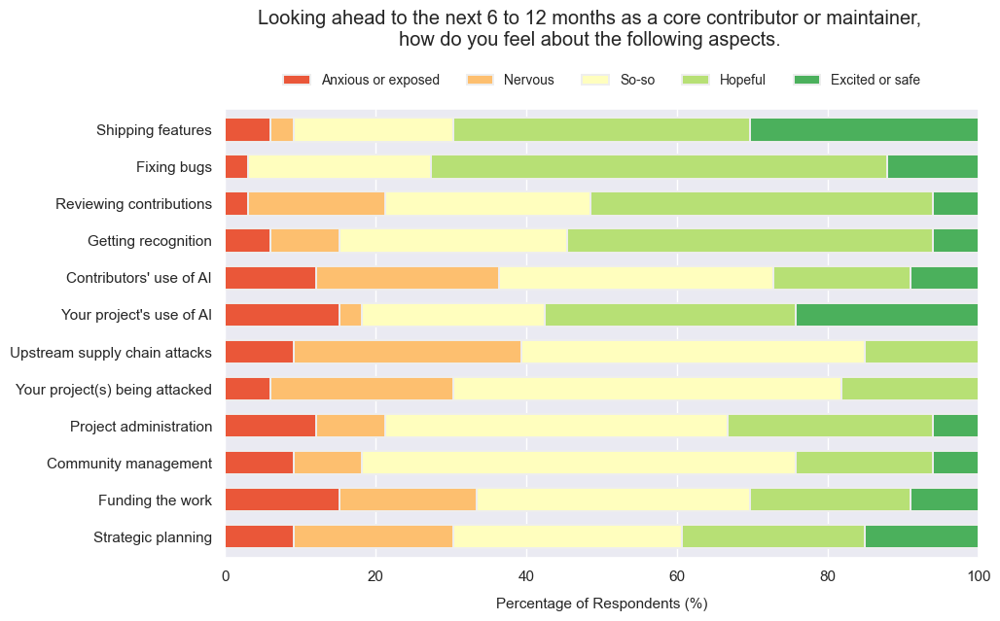
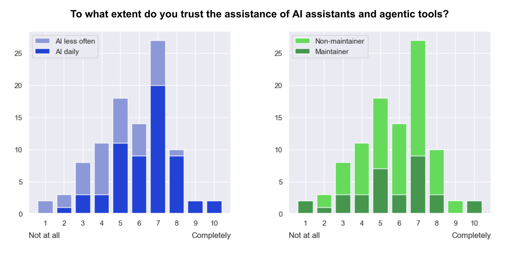
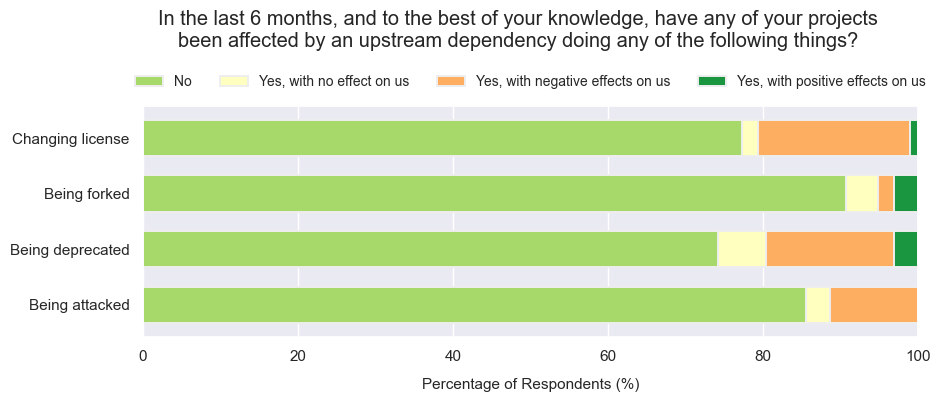

Ahead of the EAGE workshop [last week](../open-for-energy), I was unsure if we were going to find **open source** in good health, or reading its last will & testament... maybe even performing CPR. In the event, we established that open source is very much alive — but I knew before the meeting that the sample would not be big enough to represent the whole community.

So at the end of May I ran a survey. I shared the Google Forms survey on LinkedIn and in [Software Underground](https://softwareunderground.org/) on 18 May, and closed the survey on the day of the workshop on 7 June, giving 20 days during which the form received 97 anonymous responses.

I realized right away that, if I wanted the survey to be easy to complete, it would be very difficult to ask everything I wanted to ask. I wanted to know about people's own attitudes and activities, and those of their employers and collaborators. I wanted to know about open source in general, and subsurface science and engineering in particular. I wanted to know how things are today, and how they are changing over time. In the end, focusing on the current state of things, I setttled on 30 questions addressing five aspects of open source:

- Use of open source software.
- Activities as a core contributor (i.e. maintainer).
- Activities as a non-core contributor.
- Artificial intelligence.
- Funding and sustainability.

[📁 **All the results can be found here.**](https://github.com/kwinkunks/open-source-survey-2026) **This post looks at some highlights from the responses.**

## Demographics

When looking at all of this data, remember that we're only looking at a small subset of people that (a) I reached and (b) responded. Of course, there's quite a bit of sample bias here.

- 97 responses, mostly from Europe (43) and North America (30).
- Most respondents are applied scientists (62) or coders and data scientists (26).
- Nearly a third (29) of respondents are in organizations with more than 10 000 employees; about a third (34) in orgs smaller than 100.
- Respondents work in service and technology companies (30), operating companies (27) and academia (21):

## Open source

To try to capture the current state, most of the questions in all sections asked respondents to consider only the most recent six months when answering.

- 65 respondents work in teams that strongly prefer or lean towards open-source technical tooling. 
- 67 respondents use open-source software at least weekly for subsurface workflows.
- When people choose open options for technical work, three reasons dominate: extensiblity, transparency (of functionality like algorithms) and cost, with 56 to 60 respondents choosing each of these features.

## Maintaining projects

- A third of respondents (33) are maintainers (this role includes core contributors) of open-source projects. Of these, 27 help maintain at least one subsurface-related project.
- 12 of the 33 maintainers work alone on their primary project; 4 of 33 have six or more co-maintainers.
- 9 of the primary projects of the 33 maintainers are unfunded.
- I asked how maintainers feel about some specific tasks in the near future:

## Contributing to projects

- 39 respondents contributed to at least one project they do not maintain. A few (7) people make at least one contribution per month.
- The main barrier to contribution is a lack of time, incentive, or permission (perceived or otherwise), with 47 respondents choosing these reasons.
- The top contribution types: creating issues (25 respondents, so 64% of those making contributions), small documentation fixes (18, or 46%), non-critical bug fixes (16), new tests (14), and new features (13).

## Artificial intelligence

Open source has a complicated relationship with AI, as most of the rest of the world. Maintainers and would-be contributors sense it could help with some tasks, while it also seems to present some new security challenges — and the threat of sloppy contributions that no-one wants to review. 

- 60 respondents use AI assistants or agentic tools daily; 12 rarely or never use them.
- Those using AI less often tend to have less trust in the technology (see below).
- There is no correspondence between trust and those having maintainer roles:

- Respondents are slightly more concerned about IP issues in upstream dependencies (only 22 not concerned) than they are about introducing such problems into their own code (28 not concerned).
- People think AI may improve access to technology: 71 respondents agree that AI code assitants lower the barrier for non-programmers to use digital products, while 51 respondents agree that AI lowers the barrier for non-programmers to contribute to projects.

## Organizations

- Only 16 respondents report leader resistance to open source; 59 respondents report support or enthusiasm among leadership.
- Only 7 respondents work in organizations that have eastablished open source program offices (OSPOs). Only 12 report their organization funding open source activities.
- 31 have organizations with expressed preference for open source, with 20 respondents reporting a "clear and visible" open source strategy.
- Some respondents have been affected by various kinds of disruption to open source projects they depend on:

## The future

The last question was about the health of the subsurface open source ecosystem. While only 3 people characterize the situation as 'critical', 40 respondents (41%) believe it to be at risk. On the other hand, 57 think it is at least stable and a handful believe it to be 'robust'.

**An approximately normal distribution, but skewed positive — a good description of the community itself!**

---

[_All the data and results are on GitHub_](https://github.com/kwinkunks/open-source-survey-2026)